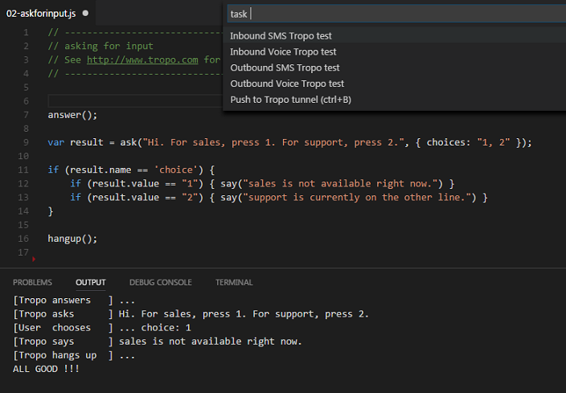

# Tropo Ready: the live coding experience for Tropo Scripting

Execute, Test or Debug your Tropo scripts from your local machine, thanks to a set of handy tools:
- have Tropo Scripting execute your local scripts thanks to a [Caddy+ngrok combo](#tropo-scripts-live-execution)
- debug your scripts thanks to the [Tropo Emulator for Javascript](#tropo-scripts-debugging)
- check your [JS scripts are consistent](#tropo-scripts-testing) before pushing them to Tropo


## Quickstart

```shell
> git clone https://github.com/ObjectIsAdvantag/tropo-ready-vscode
> cd tropo-ready-vscode
> npm install
```

Now launch VS Code, open the 'tropo-ready-vscode' project, open file /samples/tutorial/02-askforinput.js,
and press F5 to start a debugging session.

If you've installed the VS Code shortcut, simply type `code .` in the tropo-ready-vscode directory from the terminal.


## Debug your Tropo scripts from VS Code

_If not already done, type npm install on the command line._

Reach to a provided Tropo script sample, such as [02-askforinput](samples/tutorial/02-askforinput.js)

Add a breakpoint on line 9 for example, and press F5 to start a debugging session.

The Tropo emulator starts a Tropo Outbound Voice call, with your [workspace default settings](.vscode/settings.json).

Note that Tropo Ready proposes other launch configurations, pick the one that suits the Tropo script you're launching.


## Live Test your Tropo scripts

Follow these [instructions to create a live tunnel](tunnel/README.md) to the Tropo Cloud platform,


Once you have created a Tropo Scripting application reading from the tunnel,
press ctrl+shift+B to publish your script to Tropo via the `tunnel/tropo/live` folder.


## Continuous Integration Testing for Tropo scripts

_If not already done, install the `tropoready` command on your machine (the command comes with the tropo-emulator-js project)._


```shell
# On Windows
> npm install tropo-emulator-js -g
# On Mac
> sudo npm install tropo-emulator-js -g
# Check it is working ok
> tropoready -v
```

Open a provided Tropo script sample, such as [02-askforinput](samples/tutorial/02-askforinput.js), 

Launch the Tropo Ready tasks by pressing `ctrl+P`, enter `Tasks: Run task` and select `Inbound Voice Tropo test`.
Note that you can [install the ctrl+shift+y key binding](vscode/README.md) to easilly reach to the Tropo Ready Tasks.

Now, look at the Tropo Emulator results in the Output window:




# Contribute

_For now, the Tropo emulator has been tested with a limited set of Tropo scripts.
Our goal is to extend the emulator so that it would mimic most of the Tropo Scripting Cloud platform behavior.
By posting issues and scripts, you're contributing to the project, thanks!_

That being said, there are good chances you encounter an issue when running one of your Tropo scripts.
Please, OPEN an issue and post your script raw contents, as this is the default process to enhance this project.
/!\ Make sure to remove any sensitive data from your script before posting.

**If you have skills in Python, Ruby, PHP or Groovy, we'd love you to help us port the Tropo emulator to these platforms.**
Simply fork the Tropo emulator project, and start your own version for your favorite language.
Drop us a message if interested, we'll be happy to contribute!

And if you like the project, don't forget to twitt or write about it ;-)


