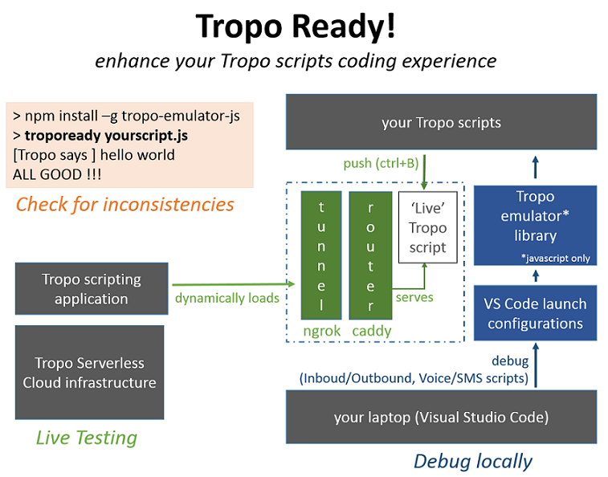
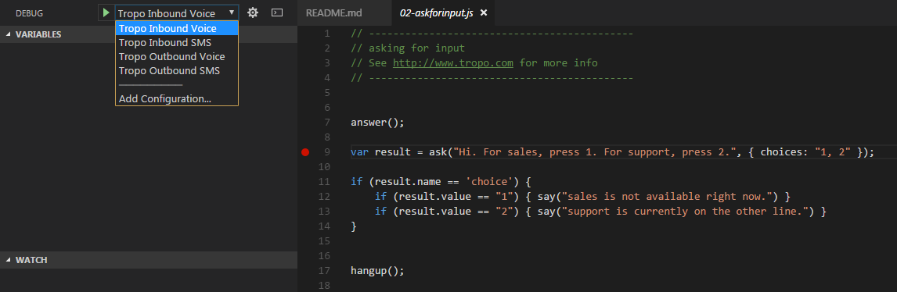

# Tropo Ready for VS Code

Execute, Test or Debug your Tropo scripts from your local machine, thanks to a set of handy tools:
- have Tropo instantly execute your scripts thanks to a [Caddy+ngrok combo](tunnel/README.md)
- check your scripts are consistent before pushing them to Tropo (Javascript only)
- use Launch configurations to debug your Tropo scripts within Visual Studio Code (Javascript only)




## Tropo scripts Debugging

Type `npm install` in the VS Code terminal.

Then Reach to a provided Tropo script sample, such as [02-askforinput](samples/tutorial/02-askforinput.js)

Add a breakpoint on line 9 for example, and press F5 to start a debugging session.

The Tropo emulator starts a Tropo Outbound Voice call, with your [workspace default settings](.vscode/settings.json).

Note that Tropo Ready proposes other launch configurations, pick the one that suits the Tropo script you're launchinh




## Tropo scripts Testing

Install the tropoready command on your machine.

```shell
> npm install tropo-emulator -g
# Check it is working ok
> tropoready -v
v0.1.0
```

Now, open a provided Tropo script sample, such as [02-askforinput](samples/tutorial/02-askforinput.js), 

Launch the Tropo Ready tasks by pressing `ctrl+P`, enter `Tasks: Run task` and select `Inbound Voice Tropo test`.

Look at the test results in the Output window.

Optionally, [install the ctrl+y key binding](vscode/README.md) to easilly reach to the Tropo Ready Tasks.


## Tropo scripts Live Execution

Follow these [instructions to create a live tunnel](tunnel/README.md) to the Tropo Cloud platform.

Then press ctrl+B to push your script.


## Add Tropo Ready to an existing workspace

If you want to add the Tropo Ready customizations to an existing Visual Studio Code Workspace,
check instructions from the [vscode folder](vscode/README.md).


# Contribute

_For now, the Tropo emulator has been tested with a limited set of Tropo scripts.
Our goal is to extend it to mimic the Tropo Scripting runtime behavior.
By posting issues and scripts, you're contributing to the project, thanks!_

That being said, there are good chances you encounter an issue when running one of your Tropo scripts.
Please, OPEN an issue and post your script raw contents, as this is the default process to enhance this project.
/!\ Make sure to remove any sensitive data from your script before posting.

**If you have skills in Python, Ruby, PHP or Groovy, we'd love you to help us port the Tropo emulator to these platforms.**
Simply fork the Tropo emulator project, and start your own version for your favorite language.
Drop us a message if interested, we'll be happy to contribute!

And if you like the project, don't forget to twitt or write about it ;-)


