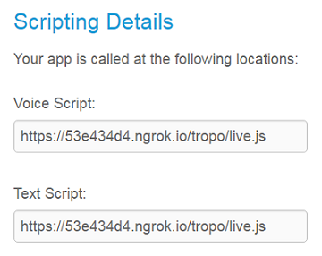

# Tropo Ready! the live coding experience for Tropo Scripting

Run, test and debug your Tropo scripts from your local machine, thanks to a set of handy tools:
- [have Tropo execute your local scripts](#live-test-your-tropo-scripts-any-language) thanks to a Caddy+ngrok combo,
- [debug your scripts locally](#debug-your-tropo-scripts-from-vs-code-js-only) thanks to the Tropo Emulator for Javascript,
- [test your JS scripts](#testing-for-tropo-scripts-from-vs-code-js-only) from VS Code before pushing them to Tropo Scripting platform.


## Live Test your Tropo scripts (any language)

Follow these [instructions to create a live tunnel](tunnel/README.md) between the Tropo Scripting platform and your local machine:


Then, create a Tropo Scripting application that reads scripts from the tunnel:




Now, press 'ctrl+shift+B' to publish your script to Tropo via the `tunnel/tropo/live` folder on your local machine.

You're all set: call your application's Tropo number and listen to your scripts live!


## Debug your Tropo scripts from VS Code (JS only)

Open a terminal and type:

```shell
> git clone https://github.com/ObjectIsAdvantag/tropo-ready-vscode
> cd tropo-ready-vscode
> npm install
```

Then, launch Visual Studio Code, and open the 'tropo-ready-vscode' project.
_Note that if you've setup the VS Code shortcut, simply type `code .` in the tropo-ready-vscode directory of the terminal above._


Reach to a provided Tropo script sample, such as [02-askforinput](samples/tutorial/02-askforinput.js)

Add a breakpoint on line 9, and press F5 to start a debugging session.

The Tropo emulator starts a Tropo Outbound Voice call.


_Note that Tropo Ready! can help you debug Inbound/Outbound and Voice/SMS scripts: simply pick a [VS Code launch configuration]((.vscode/settings.json) and customize it to match your test needs_


## Testing for Tropo scripts from VS Code (JS only)

If not already done, use npm to install the `tropoready` command on your machine. 
The tropoready command comes with the [tropo-emulator-js project documented here](https://github.com/ObjectIsAdvantag/tropo-emulator-js#how-to-test-for-inboundoutbound-tropo-calls-for-voice-or-sms).

```shell
# On Windows
> npm install tropo-emulator-js -g
# On Mac
> sudo npm install tropo-emulator-js -g
# Check it is working ok
> tropoready -v
v0.4.0 (or above)
> tropoready -h
Usage: tropoready [--script] <your-script.js>

Simulates a Tropo runtime environment to quickly check for obvious inconsistencies (syntax error, wrong arguments).
By default, starts the specified script in the context of a Tropo Inbound Voice call.

To test for an Outbound SMS call, try:
   > tropoready <your-script.js> --outbound --SMS

To pass parameters, try:
   > tropoready <your-script.js> --parameters "phonenumber=+33678007800" "msg=Hello world!"
```

Then, open a provided Tropo script sample, such as [02-askforinput](samples/tutorial/02-askforinput.js), 

Launch the Tropo Ready tasks by pressing `ctrl+P`, enter `Tasks: Run task` and select `Inbound Voice Tropo test`.

Now, look at the Tropo Emulator results in the Output window:


_Note that you can [install the `ctrl+shift+y` key binding](vscode/Install.md) to easilly reach to the Tropo Ready! Tasks._ 


# Contribute

_For now, the Tropo emulator has been tested with a limited set of Tropo scripts.
Our goal is to extend the emulator so that it would mimic most of the Tropo Scripting Cloud platform behavior.
By posting issues and scripts, you're contributing to the project, thanks!_

That being said, there are good chances you encounter an issue when running one of your Tropo scripts.
Please, OPEN an issue and post your script raw contents, as this is the default process to enhance this project.
/!\ Make sure to remove any sensitive data from your script before posting.

**If you have skills in Python, Ruby, PHP or Groovy, we'd love you to help us port the Tropo emulator to these platforms.**
Simply fork the Tropo emulator project, and start your own version for your favorite language.
Drop us a message if interested, we'll be happy to contribute!


## Spread the word

Call +1-888-241-5444 (tool free) for a fun voting experience! like it? [check the code](https://github.com/ObjectIsAdvantag/tropo-ready-vscode/blob/master/samples/request/speak-stars-with-chatops.js). 
