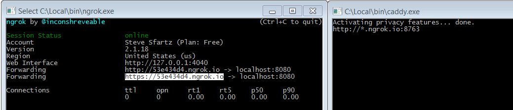
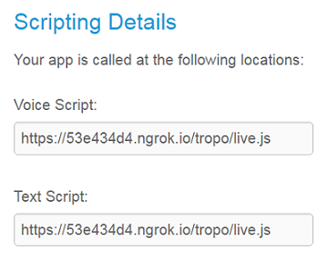

# Your local scripts accessible to Tropo Scripting Cloud platform

Tropo Ready uses Caddy and ngrok to make your scripts accessible from the Tropo Cloud platform.

- Caddy exposes the files located in the tropo folder on port 8763 and serves the requests coming from an ngrok.io tunnel
- ngrok exposes port 8763 of your laptop to this internet to an http and an https endpoint on a ngrok.io subdomain


## Quick start

Download the [Caddy](https://caddyserver.com/download) and [ngrok](https://ngrok.com/download) on your machine, 
and add the executables to your path.

Then type `cd tunnel & make`.

Reach to the ngrok window to retrieve your newly exposed https endpoint.




Alternatively, you can use ngrok API and [jq](https://stedolan.github.io/jq/download/).

```shell
> curl http://localhost:4040/api/tunnels -H "Content-Type:application/json" | jq '.tunnels[1].public_url'
"https://47de8972.ngrok.io"
```

Now create a new [Tropo Scripting](http://tropo.com) application pointing to your endpoint and append "/tropo/live.js".
In our example: "https://47de8972.ngrok.io/tropo/live.js"




You're all set, simply reach to a Tropo script in the samples directory for instance, 
and type ctrl+B to publish the script to the tunnel file.js.

